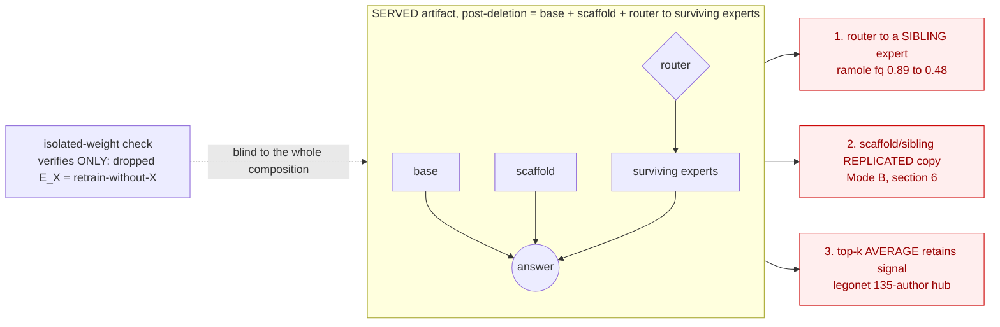
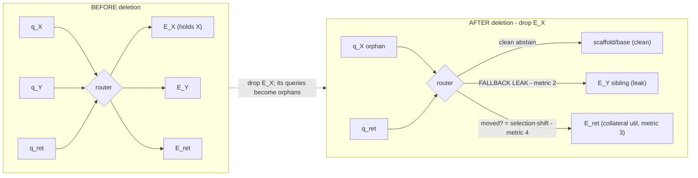

# Exact Machine Unlearning for LLMs — Literature Gaps & Novelty Map

**Date:** 2026-06-29 · **Author:** jack (with Claude) · **Status:** survey / direction-setting
(not an experiment entry — a cross-thread synthesis)

> **How to read this:** it is written to be understandable *from scratch*. §1 defines the
> problem, §2 summarizes the papers in `~/papers/`, §3 summarizes what this project has
> already built, §4 is the gap analysis, §5 is the ranked set of directions. If you only
> read one thing, read the **TL;DR** below and §4.1 (the meta-gap) + §5 (directions).
>
> **Update 2026-06-29 (post-survey):** folded in fresh experimental results from
> [`tofu_sisa_lora/reports/ORIENTATION_2026-06-29.md`](../tofu_sisa_lora/reports/ORIENTATION_2026-06-29.md)
> — see **§3.6** (the scaffold+route result) and the revised **§5**. They *confirm* the meta-gap
> with a head-to-head utility table and *validate* what was direction §5.3, so the directions
> are re-prioritized and the headline contribution is reframed. Also added the **APA** paper
> (not yet in `~/papers/`) to §2A.
>
> **Update 2026-07-01 (review-question expansion):** added four sections in response to review
> questions — **§6** ("just separate the facts" objection: Mode-A *splitting* vs Mode-B
> *replication*), **§7** (per-method "exact by construction" leakage audit), **§8** (composed-model
> MIA-vulnerability chart), **§9** (SEUF integration + the **§9-D post-deletion routing experiment**:
> where orphaned queries route and whether that costs utility). Corpus grew to **20 papers** with two
> new attack/eval entries: **SEUF** (§2B/§9) and **Unlearned but Not Forgotten** (§2C) — a
> pre/post-checkpoint data-extraction attack showing clean structural exactness can *increase* leakage
> (see §4.3 "double-edged," §8 threat-model caveat). Schematics in §7/§9-D are Mermaid.

---

## TL;DR

- **Goal of the project:** make deleting a user's/author's data from a trained LLM a *cheap,
  deterministic, O(1)-style "drop a module/slice"* operation — **exact** (indistinguishable from
  retraining without that data), not approximate gradient surgery.
- **The one meta-gap across every paper *and* every thread we've run:** exactness is always
  guaranteed at the level of a **shard / slice / task / adapter**, under a **disjoint-data
  assumption**, and is **asserted structurally but never empirically audited**. Two holes nobody
  has closed:
  1. **A fact replicated/entangled across multiple units survives deleting one unit.** ("Forget
     author X" fails if X's facts also live in other authors' adapters.)
  2. **No adversarial proof that the dropped unit leaked nothing** — TOFU's `forget_quality` is a
     single-reference KS test, explicitly *not* (ε,δ)-unlearning, and is gameable by a model that
     just emits gibberish.
- **Where we're already ahead of the literature:** our `legonet_lora` thread *verifies* exactness
  two ways (bitwise on CPU, distributional vs an oracle retrain on GPU); the papers only *assert*
  it. We've also *quantified* the merge-dilution curve and *hit* the co-adaptation ceiling that
  one paper only proves in theory.
- **Validated result (2026-06-29, §3.6):** *don't merge — route + add a public scaffold.* A shared
  public-data LoRA "scaffold" (2k Alpaca QA, never deleted) + per-cluster routed experts reaches
  `model_utility` **0.664 — above dense full-FT (0.599)** — with trivial O(1) exact deletion, and
  holds in the realistic no-author-labels setting (encoder cluster-ID routing, **0.645**). The two
  published efficient-exact LLM methods crater on the same benchmark (S³T **0.370**, APA **0.462**),
  confirming the meta-gap with hard numbers.
- **Revised contribution & directions (§5):** the headline is no longer "a new exact mechanism + an
  audit." It is **(a)** the *scaffold + route* decomposition and **(b)** the diagnosis of *why
  merging fails on factual data* — thesis: **facts → route, skills → merge.** Priority order:
  (1) the **mechanism study** (second factual + a skill dataset + direct interference measurement)
  that turns the diagnosis into a generalization result; (2) the honesty checks (decompose utility;
  full-FT+scaffold fairness ablation); (3) the **residual-leak / entanglement check** (the demoted
  but still-needed remnant of the old §5.1/§5.2 — encoder centroids must not be fit on forget data;
  sample-level clustering can split a fact across experts).

---

## 1. Problem framing

**Machine unlearning** = given a model trained on dataset *D* and a deletion request for a subset
*D_f* ("right to be forgotten"), produce a model that behaves as if it had been trained on
*D \ D_f*.

- **Exact unlearning:** the unlearned model is *identical in distribution* to one retrained from
  scratch on *D \ D_f* (the gold standard, SISA's Def. III.1). Stronger than differential privacy
  or "certified removal."
- **Approximate unlearning:** gradient ascent / fine-tuning that *pushes* the model away from *D_f*
  (e.g. the TOFU baselines GA/GD/KL/IDK). Cheap but no guarantee; can leave residual, can damage
  utility, is hard to certify.

**Our design ideal (from `CLAUDE.md` §3):** white-box, minimal architecture change, maximum
simplicity. Deletion should be a *clean structural operation* — "remove or drop the specific
module/slice that holds the targeted data" — ideally O(1) and deterministic, **not** expensive or
stochastic weight surgery.

**Why it's hard.** In a normally-trained network, a single fact is smeared across many parameters
and entangled with other knowledge (gradient descent has an *implicit bias* toward such entangled,
min-norm solutions — proven in the MemSinks paper). So there is no "slice" to drop. Every exact
method therefore *imposes structure up front* — sharding, isolated adapters, frozen backbones — so
that a droppable unit exists. The cost of that structure is the recurring theme: **utility loss,
per-unit data starvation, storage blow-up, and the disjoint-data assumption.**

**Benchmark used throughout (`TOFU`):** 200 *fictitious* authors × 20 GPT-4 QA pairs = 4,000 pairs;
finetune an LLM on all, then "forget" a split (forget01 / forget05 / forget10 = 2 / 10 / 20
authors). Two metrics:
- **`model_utility`** = harmonic mean of 9 numbers (Probability, ROUGE-L, Truth-Ratio) over
  {Retain, Real-Authors, World-Facts}. Any near-zero component tanks it.
- **`forget_quality`** = p-value of a two-sample KS test comparing the *Truth-Ratio distribution on
  the forget set* between the unlearned model and a **retain model** (finetuned on retain-only =
  the LLM analogue of retrain-from-scratch). High p = indistinguishable = good forgetting.
  Reference: retain-vs-retain p ≈ **0.90**; finetuned-vs-retain ≈ **2.4e-19**.

---

## 2. The paper corpus (20 papers, three families)

### 2A. Exact-unlearning *systems*

| Paper | Mechanism | Exactness / unit | Deletion cost | Key limitation |
|---|---|---|---|---|
| **SISA** (Bourtoule et al.) | Shard → isolated model per shard → sliced checkpoints; aggregate by vote | Distributional exact; **unit = sample**, recompute = slice-to-end of one shard | up to (R+1)S/2× speedup; measured 1.36–8.0× | Shards = weak learners (ImageNet −19.45pp); "**no way to measure the influence of a data point**"; assumes honest provider |
| **S³T** (Scalable Exact via PEFT) | One LoRA layer per slice, top-down; delete = **deactivate** downstream LoRA layers; keep multiple slice-permutations | Structural exact; **unit = slice** | common case **O(1)**, L× less storage than SISA; ~1.6× more deletes (B=8), 2.8× faster than SISA | cost shifts to offline pre-training; finer slicing hurts accuracy; excludes pretraining data; **utility craters on TOFU (mu 0.370 @K=16, §3.6)** |
| **APA** (Hu et al., IEEE TKDE 2025) ⚠ *not yet in `~/papers/` — obtain & read* | Exact/efficient unlearning for **LLM-based movie recommendation** (recsys, not QA); partition-and-aggregate over PEFT adapters (mechanism TBD on read) | Exact; unit = partition | efficient delete (per paper) | **utility craters on TOFU (mu 0.462 @K=16, §3.6)** — but it was built for movie-recsys, so its TOFU number is an *out-of-domain transplant*; whether the gap is the method or the domain mismatch is exactly the open question (§5.0) |
| **ACU** (Efficient & Exact Forgetting Services) | Closed-form (ridge) classifier head; recursive Woodbury update on a "knowledge-tracking matrix" | **Deterministically exact** — but **only the linear head; backbone frozen**; unit = sample *and* class | independent of N and #requests; 50–125× faster than approx, >10,000× vs retrain | exactness **never touches the representation**; finite-precision Woodbury risk; image-only |
| **FedSGT** (Federated, Sequential Group-based) | Clients' slices → L balanced groups; chained frozen-prefix PEFT modules; delete = deactivate group + downstream | Distributional exact; **unit = data group** | single delete O(1); ~2.5× more deletes than baseline | δ-theory assumes **independent/uniform single-group requests**; deleting an early group kills a long suffix |
| **SIFT-Masks** (Exact Unlearning via Model Merging at Scale) | Sum task vectors into one merged model + per-task masks; **SIFT** constrains each τ to a fixed random sign so masks are local; delete = re-finetune τ_u, subtract, drop mask | Exact **by construction** (needs bit-for-bit deterministic retrain); **unit = task** | **O(1) in #tasks**; up to 250× less compute than central retrain | hinges on perfect determinism (never audited); merged model collapses toward zero-shot at ~200 tasks; same-fact-across-tasks unaddressed |

### 2B. Modular / merging / adapter

| Paper | Mechanism | Relevance & deletion unit | Scaling behavior | Key limitation |
|---|---|---|---|---|
| **LegoNet** (frozen encoder + distance-keyed adapters; the basis for our `legonet_lora`) | Frozen encoder; *n* isolated adapters with frozen keys; top-*k* nearest activated & averaged; delete = **retrain only the k adapters a sample hit** | Purpose-built exact unlearning; **unit = the ≤k adapters a sample activates** | n=100→1000 costs only −0.66%/−1.80% acc; 51.2K vs 3.68M re-trained params/delete vs SISA | "price of the fixed encoder" (utility loss); no external-pretrain-data case; never measures forget-quality / MIA |
| **RAMoLE** (Retrieval-Augmented Mixture of LoRA Experts) | LoraRetriever (top-k cosine) + trained **RouterLoRA** cross-attention weights retrieved experts per-token | Not for unlearning, but **router decoupled from the LoRA set** → drop a LoRA needs **no router retrain**; unit = one LoRA | tested at 48 LoRAs; param-fusion *collapses* with #LoRAs, RAMoLE *plateaus* | retrieval top-1 only 63–74% → good routing **answers from similar surviving experts** (adversarial to forgetting); 48-LoRA scale |
| **Compress-then-Serve (CtS)** (basis of our JD thread) | Joint-diagonalize many LoRAs into a **shared basis U,V** + tiny per-LoRA Σ_i; cluster to scale | Repurposable but **poor for exact delete**: U,V fit from *all* members → dropping Σ_i is **not exact** | 1000+ LoRAs, 1.6× throughput; recon<0.6 keeps ≥99% perf | "all Σ_i equal = fully merged" lower bound — lives on a separate↔merged spectrum; leakage flagged, unstudied |
| **Task Arithmetic** | Task vector τ = θ_ft − θ_pre; edit by ±τ in weight space | "Forgetting via negation" = approximate; unit = whole task vector | adding 2→8 vectors: 98.9%→91.2% utility; relies on near-orthogonality | negation leaves residual (target still ~19% acc); λ validation-tuned (non-deterministic) |
| **DARE** ("Super Mario") | Drop p of delta params, rescale by 1/(1−p), then merge | Argues *against* merge-then-delete: sparsify+sum ⇒ **no invertible per-task slice**; Bernoulli drop is stochastic | drops 90–99% of deltas; tolerance grows with model size; 3-task merge already dilutes | needs small deltas (<~0.002); merges into one model — no decomposable library |
| **SEA** (Separable Expert Architecture; basis of our `sea_tofu`) | Frozen base + shared expert LoRAs + **per-user proxy** (routing bias + steering vectors + rank-4 personal LoRA); user gradients never touch shared weights | **Designed for deterministic unlearning**; **unit = the per-user proxy directory** (delete = `rm`) | only **4 users / 4 experts** tested; O(1) drop | shared *expert* layer is still merged (CtS-style entanglement); routing accuracy never measured; verification passes only 82–89% |
| **SEUF** (Zhuang et al., arXiv 2411.18797, 2025) ⚠ *approximate, not exact* | Native-MoE unlearning: **expert attribution** (gating-score affinity) picks the top-1 target expert + **router anchor loss** keeps it activated during gradient unlearning | **Not exact** (gradient-based); unit = one MoE expert. Relevance = its tools repurpose as *audits* for us — full treatment in **§9** | +35% utility / +5% fq, 0.06% params, on DeepSeek-/Qwen-MoE | gradient unlearning (no guarantee); needs a native soft-router MoE; "expert selection shift" is itself our §7/§8 router-leak mechanism |

### 2C. Localization / memorization / evaluation

| Paper | Finding | Localization strength | Relevance / what's missing for *exact* |
|---|---|---|---|
| **Gradient Routing** (ERA) | Mask gradients so chosen data updates chosen params; delete = remove those neurons | Moderate, train-time (MNIST digit split; "absorption effect") | Robust ≠ exact: capability *recovers* after ~2 examples; needs repair fine-tuning (drop+retrain, not clean drop) |
| **Beyond Data Filtering / SGTM** | Pre-designate a fixed slice (1 of 32 heads + 64 MLP units) per block; forget data updates only it; delete = **zero the slice** | **Strongest train-time evidence**: leakage **0.005–0.02** at 40% undiscovered forget data; 7× harder to relearn than RMU | Near-exact, not exact: leakage low but **non-zero**; slice budget fixed a priori; ≤254M-param proxy models |
| **Can NN Memorization Be Localized?** | Memorization = ~5 neurons *distributed across layers* (not final-layer); example-tied dropout routes it | Negative on layers, positive on distributed neurons; drop → mislabel acc ~100%→0.1–3.1% | 3.1% residual; image label-noise, not LLM facts; atypical examples harder |
| **Memorization Sinks** (MemSinks) | Per-sequence ID activates unique "sink" neurons; drop at inference. **Theorem 4.1:** even forced masking leaves co-adaptation ‖f_d−f̃‖²≥cN, *growing* with training | Architectural, train-time, LLM-scale (≤1.7B); closes only **~50%** of the memorization gap | **Proves localization ≠ removability**; explains why naive equal-sharding ceilings; sinks collide across sequences |
| **ERASE** (Fast Exact Unlearning for ICL data) | Adapt via in-context demonstrations (quantized k-means), not SGD; delete = drop a demonstration/centroid | Relocates data *out of the weights*; provably exact over the *selection* algorithm | Exact only because **data never enters the weights** (fine-tuning-stage, ⟂ pretraining); inference-cost tax |
| **ICUL** (In-Context Unlearning) | Prepend the forget point with a flipped label at inference | No localization; **weights untouched, data 100% recoverable** | Purely behavioral; a *baseline to beat*, not a structural delete; PII injected at serving time |
| **TOFU** (benchmark) | 200 fictitious authors; finds **no baseline unlearns without wrecking utility** | None (behavioral I/O only) | `forget_quality` is a **single-reference KS test, not (ε,δ)**, gameable by gibberish; tests neither exactness nor auditing |
| **Unlearned but Not Forgotten** (Wu et al., NeurIPS 2025) — *an **attack** on exact unlearning* | A **pre/post checkpoint-diff data-extraction** attack: use the pre-unlearning model to *guide* the post (contrastive decoding + token filtering); the logit **delta = the removed-data distribution**. **Doubles** extraction on MUSE/TOFU/WMDP + a synthetic medical set, and **exact unlearning leaks *more* than approximate** (higher post-utility ⇒ sharper delta) | N/A (attack, not localization) | Breaks "exact ⇒ safe": under a **pre+post-checkpoint adversary** the leak is in the *delta*, so post-model exactness gives no protection — and **clean structural exactness may *hurt*** (§4.3, §8). DP-SGD only a *partial* defense at ruinous utility cost (their §5.7); the honest fix is **deployment-side** (don't expose both checkpoints) |

---

## 3. What this project has already built (five threads)

(Full detail in each thread's README under `log/`. Numbers below are real, from those entries.)

- **`sisa_lora`** — Shard TOFU data into *k* slices, one LoRA per shard, serve by **merging** or
  **routing**; delete = drop/recompute the affected shard.
  - **Merging dies under dilution:** `dare_ties` utility decays 0.74 (k=1) → 0.42 (k=200) = base.
  - **Routing is the winner at high k:** `routed_key_exact` @k=50 → mu **0.71**, O(1) delete.
  - **JD/Compress-then-Serve port:** TOFU author shards barely compress (recon **0.87** at
    k100/c7 vs the paper's <0.6 regime) — selective keep/drop stays "O(1)-style" but the shared
    basis entangles.
  - **Additive coarse-core (the headline):** a strong retain-90 core (never sharded) evaluated
    standalone = forget10 unlearned → mu **0.7537** ≈ joint-ft 0.740, forget_ppl ≈ base, with
    O(1) deletion. The **equal-shard** alternative ceilings at **~0.48** (the co-adaptation wall).
- **`legonet_lora`** — Frozen base + *n* k-means-keyed LoRA adapters, top-k routing; delete =
  retrain only affected adapters.
  - **Verified exactness two ways:** bitwise (CPU/TinyLlama, max_rel_l2 0) and distributional
    (7B: affected rel_l2 ≈ the untouched-adapter nondeterminism floor vs an oracle retrain).
  - **Utility preserved, beats SISA merges:** TOFU 7B unlearn mu **0.637** / fq **0.808**, vs SISA
    `dare_ties` 0.48/0.39.
  - **Open problems:** forget signal is **dilution-limited** under k=3 averaging; TOFU author
    clustering produces a **hub** adapter (135/200 authors); no raw deletion-cost win at moderate n.
- **`ramole`** — Learned retriever + RouterLoRA over the LegoNet pool; the router is trained on a
  disjoint reference split so **deletion needs no router retrain** (exactness preserved).
  - Router **> uniform 1/k < perfect** on the same experts (modest, because DBpedia is too
    homogeneous).
  - **Routing costs forget-quality:** on TOFU, embedding-RAG routing dropped `forget_quality`
    **0.89 (author-key lookup) → 0.48 (embedding RAG)**.
- **`sea_tofu`** — One per-author LoRA proxy; delete = `rm`. Clean structural unlearning; rank knee
  at r8; `forget_quality` is construction-trivial (so it carries no signal — the science is the
  rank/size "deletability tax").
- **`s3t`** — Faithful repro of the S³T paper on TOFU; reproduced the deletion-rate combinatorics
  (B=4 handles ~1.6× more deletions than SISA). Complete.

### 3.6 The 2026-06-29 result — *don't merge, route + scaffold* (the current headline)

(From [`tofu_sisa_lora/reports/ORIENTATION_2026-06-29.md`](../tofu_sisa_lora/reports/ORIENTATION_2026-06-29.md),
v2. All numbers Llama-3.2-1B, `model_utility`.)

**(a) The problem, with hard numbers.** Both *published* efficient-exact LLM methods crater on TOFU
utility, landing in the same ~0.37–0.46 band as our own LoRA-*merging* experiments (~0.45 cap):

| Model | `model_utility` |
|---|---|
| pretrained (no TOFU) | 0.281 |
| **S³T** (ICLR 2025), K=16 | **0.370** |
| **APA** (TKDE 2025), K=16 | **0.462** |
| best single-LoRA (r256) | 0.590 |
| dense full fine-tune | 0.599 |

So the utility hole is **not** a quirk of one method — it is what happens when you **combine
factual-knowledge adapters** (whether by merging or by S³T's slice-deactivation).

**(b) The turn — route to an isolated expert + a shared public scaffold:**

| Setup | `model_utility` |
|---|---|
| scaffold only (Alpaca QA, *no* TOFU knowledge) | 0.368 |
| routing only, no scaffold (base + routed expert) | 0.555 |
| **routed + scaffold** (base + scaffold + routed expert) | **0.664** |

**0.664 > dense full-FT (0.599)**, while keeping trivial O(1) exact deletion (drop one adapter,
retrain only it). The "scaffold" is the novel ingredient — a LoRA trained on *public* data, shared
by all queries, **never deleted**, that restores generic QA competence. It is a *cleaner* version of
the §5.3 "retain-core" idea: because it holds only public capability it can't leak forget data and
never needs deletion.

**(c) It survives the realistic setting** (no oracle author labels):

| Clustering | K | Routing | `model_utility` |
|---|---|---|---|
| forget-aware (author) | 16 | by author | 0.664 |
| random (author-level) | 16 | by author | 0.667 |
| per-author | 200 | by author | 0.665 |
| **random (sample-level)** | 16 | **encoder cluster-ID** | **0.645** |

Read-offs: **how you cluster barely matters** (0.664 ≈ 0.667 ≈ 0.665), and the **realistic** path —
cluster samples, route with a sentence encoder, no author labels — costs almost nothing (0.645 vs
0.664). Forget results aren't reported because deletion is *inherently* retain-only by construction
(remove the data, don't suppress it) — perfect forgetting "for free" **under the disjoint-data
assumption** (see §4.1 — this is exactly the assumption that must be checked for sample-level
clustering).

---

## 4. The gap analysis

### 4.1 The meta-gap

Every exact method here — **and every thread we've run** — provides a guarantee that is:

1. **At the granularity of a shard / slice / task / adapter**, never a *fact*; and
2. **Conditioned on a disjoint-data assumption** (one sample/fact lives in exactly one unit); and
3. **Asserted structurally, not audited** (no membership-inference / extraction test on the
   post-deletion *composed* model).

The two unsolved consequences:

- **Replicated / entangled facts survive a single-unit delete.** If a phone number, passage, or
  fact about a person appears in several shards/adapters (the realistic case), dropping one copy
  leaves the others answering. SISA, S³T, FedSGT, SIFT all *assume this away*; our threads all map
  one author → one cluster and never test it.
- **No adversarial proof of removal.** TOFU's `forget_quality` is gameable (a gibberish model
  passes the KS test), single-reference, and explicitly *not* (ε,δ)-unlearning. The localization
  papers lean on loss proxies that "may not conclusively demonstrate elimination."

> **Deep dives (added 2026-06-29):** the "just separate the facts" objection to consequence 1 →
> **§6** (Mode-A *splitting* vs Mode-B *replication*); a per-method audit of where "exact by
> construction" breaks → **§7**; predicted MIA vulnerability per method → **§8**; SEUF tools
> repurposed as audits for both consequences → **§9**.

### 4.2 Convergent gaps and where we stand

| Gap (appears in all three paper families) | Literature status | Our threads | Opening |
|---|---|---|---|
| **Same fact across many units** | Universally assumed away | Untouched; legonet's top-k already *touches* multiple adapters but never propagates a delete | **Widest open — biggest novelty** |
| **Empirical exactness audit** | None run MIA/extraction on the composed model; TOFU punts (>500 models "infeasible") | **Ahead — but only for the *isolated dropped unit*:** legonet verifies bitwise + distributional vs oracle for the dropped adapter's *weights*; the *composed* served model is never audited (§5.2) | MIA on the composed model → methods contribution (§5.2) |
| **Merge→entanglement vs route→dilution** | The central unresolved tension | **Quantified it** (merge 0.74→0.42; routing wins; additive core *escapes* at 0.7537) | Push the escape route (§5.3) |
| **Compress 1000s of adapters AND drop exactly** | Mutually exclusive (CtS shared basis ⇒ inexact drop) | JD port confirmed: TOFU shards recon 0.87, won't compress | Deletion-safe basis (hard, high-value) |
| **Localization ≠ removability (co-adaptation)** | MemSinks proves ‖f_d−f̃‖²≥cN; SGTM leakage 0.005–0.02; MemSinks closes ~50% | **Hit it empirically** (equal-shard ceiling ~0.48) | "Don't shard the retain side" *is* the workaround — frame it |
| **Sequential/streaming deletion → hard wall** | SISA shards shrink; S³T/FedSGT exhaust permutation budget; SIFT/ACU lose utility per delete | Routing (legonet/ramole) doesn't shrink — more graceful, but untested under a stream | Measure + add online capacity re-introduction |
| **Frozen backbone carves out pretraining data** | ACU/S³T/SISA all exclude it | Inherited by every frozen-base thread | Honest shared limitation, not a quick win |

### 4.3 Where we are already ahead of the literature

- **We verify exactness; they assert it.** `legonet_lora` checks bitwise (CPU) *and* distributional
  (rel_l2 vs an oracle retrain) exactness. SISA, S³T, FedSGT, SIFT, LegoNet, SEA all argue
  structurally and run *no* removal audit. **Caveat (don't overclaim):** this verification covers the
  *isolated dropped unit*, not the *composed* served model (base + scaffold + router + surviving
  experts). That composition is still unaudited — it is the §5.2 opening, not a place we are yet ahead.
- **Clean exactness is double-edged (added 2026-06-29).** The very deterministic, *verified* exactness
  we tout above becomes a **liability** under the pre+post-checkpoint threat model of *Unlearned but
  Not Forgotten* (§2C, §8): because post = pre − one isolated module, the checkpoint **delta is a
  near-pure readout of the dropped data**, and the extraction attack gets *easier* the more
  post-unlearning utility we retain. Retrain-from-scratch muddies that delta with incidental
  seed/co-adaptation noise; our clean structural drop does not. So being "ahead" on clean exactness +
  full utility is exactly what sharpens the before/after contrast — "we verify exactness" must be
  paired with a **deployment-side** defense (don't release both checkpoints). Recorded so we don't
  re-derive it: DP-SGD is **not** the fix — the paper's §5.7 shows it only blunts the attack at noise
  σ≥0.4, where retain-set utility collapses to ≈the pretrained model (for us, ≈0.28 vs the 0.664 we're
  protecting); adding unrelated data barely helps (the attack is instance-level).
- **We mapped the merge-dilution frontier** quantitatively (k=1→200) — the papers only show 2–8
  tasks (Task Arithmetic) or ≤3 (DARE).
- **We hit the co-adaptation ceiling empirically** (equal-shard ~0.48) that MemSinks proves in
  theory — a ready-made theory↔experiment bridge.

---

## 5. Directions (ranked) + recommendation

> **Re-prioritized after §3.6.** Direction §5.3 (scaffold/route architecture) is now a *validated
> result*, not a bet. The center of gravity moves from "a new exact mechanism + an adversarial
> audit" to **(a)** the *scaffold+route* decomposition and **(b)** the *why-merging-fails-on-facts*
> diagnosis. §5.2 (audit) and §5.1 (entanglement) are **demoted from headline to validation layer**
> — necessary to back the realistic (encoder-routed) claim, not the contribution themselves. The
> new top priority is the **mechanism study (§5.0)**.

### 5.0 *(NEW — top priority)* Mechanism study: *why does merging fail? facts → route, skills → merge*
The scientific backbone and the generalization story. Working hypothesis (from §3.6 / the orientation
doc): the ~0.45 cap is the **memorization/factual nature** of TOFU, **not** sample similarity —
indeed higher similarity should make gradients *align* and merging *easier*, so similarity is likely
a red herring. The real axis is **memorization vs generalization**. Three experiments settle it:
- **Factual + dissimilar** dataset (multi-domain facts) → predict merging *still* fails ⇒ it's
  "factual," not "similar."
- **Skill + similar** dataset (translate/summarize/math) → predict merging *works* ⇒ similarity
  isn't the killer.
- **Direct interference measurement:** per-adapter performance drop isolated→merged; cosine of the
  LoRA deltas.
This connects straight to the localization papers already in `~/papers/` — **MemSinks' co-adaptation
Theorem 4.1** (and "Can NN Memorization Be Localized") is the theory for *why* high-magnitude,
localized, mutually-interfering factual updates blur under averaging. The resulting **"facts → route,
skills → merge"** boundary is the organizing principle of the paper.

### 5.0b *(NEW — honesty checks before claiming "beats full-FT")*
~1 day, mostly re-eval, no new training. From the orientation doc §6:
- **Decompose `model_utility`** into retain / real-authors / world-facts — likely a chunk of the
  0.664 win is the scaffold *restoring general QA that full-FT mildly forgets*, not better author
  recall.
- **Fairness ablation:** full-FT + scaffold, and single-LoRA + scaffold. If full-FT+scaffold ≈ 0.66,
  the honest headline narrows to *"exact deletion at zero utility cost"* (still strong, just precise).

### 5.1 Entanglement-aware deletion + a residual-fact-recall metric — *now a validation layer*
Deliberately replicate a fact across several TOFU authors (or exploit the built-in
real-authors / world-facts entanglement), delete **one** author, and **measure whether the fact
still answers**. No paper does this, and TOFU has no metric for it. **Why it still matters after
§3.6:** the "perfect forgetting for free" claim holds only under the disjoint-data assumption. With
**sample-level clustering** (the realistic 0.645 setting), one author's samples can split across
experts and one expert can mix authors — so dropping "author X's adapter" is no longer obviously
clean. This check (and delete-propagation over the cluster keys if entanglement shows up) is what
makes the realistic claim airtight. Demoted from headline to **the validation that backs §3.6**.
*(Deep dive: §6 splits this into Mode-A* splitting *vs Mode-B* replication*; §7 locates the break
per method; §9-A gives a SEUF-attribution recipe for the residual-fact detector.)*

### 5.2 Exactness checks — *scoped down to the one channel that survives "exact by construction"*
The orientation doc rightly puts a full **adversarial-attack audit off the table**: when deletion is
structural (drop the adapter, retrain only it), the unlearned model *equals* a retain-only fine-tune
by construction, so there is no residual to attack. What does **not** come for free, and must be
checked:
- **Encoder-router centroid leak** (orientation §6.3): in the realistic setting the cluster-ID router
  must **not** have fit its centroids on forget data — otherwise the router itself retains influence.
  This is the one real residual-leak channel; the author-name router is already clean.
- **Report `forget_quality`** and confirm it equals the oracle (currently asserted, not tabulated).
- **Gibberish-gaming guard** (cheap): confirm a high `forget_quality` isn't a degenerate-output
  artifact — relevant because TOFU's KS test is gameable (§2C).

We already have the oracle-retrain + rel_l2 infra to do all three.

**The one *adversarial* check that genuinely survives "exact by construction" — MIA on the
*composed* served model.** The "no residual to attack" argument holds only for the **isolated
dropped unit**: legonet's bitwise/distributional check proves `model − adapterX ≡ retrain-without-X`
for *that adapter's weights*. But the served artifact is not one adapter — it is the composition
`base + scaffold + router + surviving experts` (and, in legonet, a top-k average). The construction
guarantee does **not** automatically transfer to that composition, and three channels can leak
forget signal even after X's own adapter is gone:
- **the router** sends an X-like query to a *surviving similar* expert that answers about X anyway
  (RAMoLE: top-1 routing only 63–74%; embedding-RAG already cost fq 0.89→0.48);
- **the scaffold / sibling experts** may independently encode an entangled/replicated copy of the
  fact (the §5.1 case), so the composition produces it with **no single unit "owning" it**;
- **co-adaptation** in a top-k average means dropping one of k and re-averaging is a *different*
  function than the isolated-adapter check assumes.

The test: run an MIA / extraction probe **end-to-end against the composed system** (routing
included) on forget vs. retain vs. never-seen examples, and compare the forget-set membership signal
to the **oracle** — the same composition built from a model that *never trained on X*. Exact
unlearning ⟺ the attacker cannot separate the two (AUC ≈ 0.5 / matched LiRA scores). This is the
**bridge between §5.1 (does an entangled fact survive a single-unit delete?) and the audit (can an
adversary recover it?)**, it is the one audit not killed by the structural argument, and — per §4.2 —
**no paper runs it**, so it is a real methods opening rather than a sanity check. Cheap version first
(loss-threshold MIA + extraction on the composed model vs. oracle); the LiRA/shadow-model battery
only if the cheap version shows a gap.

The fuller relearn-speed battery beyond this stays as an optional footnote, not a headline.
*(Per-method MIA-vulnerability chart: §8. A SEUF-derived router fix that seals the fallback leak this
audit would expose: §9-B.)*

### 5.3 ✅ Asymmetric "core + forgettable-tail" — *VALIDATED (§3.6), now refined*
This was the recommended bet; §3.6 confirms it. Two refinements the result teaches us:
- **The core should be a *public-data scaffold*, not a retain-TOFU core.** Training the shared core
  on public Alpaca QA (a) can't leak forget data, (b) never needs deletion, and (c) still lifts
  utility above full-FT (0.664 vs 0.599). Cleaner than the original retain-90 core (mu 0.7537 but
  trained on retain authors).
- **Serve by *routing*, not additive composition.** The earlier additive-core work composed adapters
  by weighted sum; §3.6 shows pure per-query routing to an isolated expert + scaffold is simpler and
  stronger. MemSinks' co-adaptation theorem still explains *why* (the 0.48 equal-shard ceiling is the
  averaging blur this avoids). Remaining: finish **forget05 / forget01** and the honesty checks (§5.0b).

### 5.4 Deletion-safe compression *(harder)*
The JD/CtS thread showed the shared basis entangles (recon 0.87 on TOFU). A novel fix: cluster so
deletable units never share a basis (block-diagonal bases), or compress only the **retain core**
(shared) while keeping forgettable **tails** uncompressed (droppable). Dovetails with §5.3.

### 5.5 *(Smaller, measured)* Forget-quality under routing error
We already found it (ramole TOFU: 0.89 key → 0.48 embedding-RAG). Nobody else measures
forget-quality as a function of router accuracy. Quick, clean, supports §5.1.

### Recommendation (revised after §3.6)
The architecture question is answered — **scaffold + route**. The paper is now built on a *diagnosis*,
not a new mechanism:
> *Merging LoRA adapters destroys factual recall — which is why existing exact methods (S³T 0.37,
> APA 0.46) and our own merges (~0.45) crater on TOFU — while routing over isolated experts plus a
> public capability-scaffold gives exact O(1) unlearning at full-fine-tune utility (0.664). The
> organizing principle: **facts → route, skills → merge.***

Execution order:
1. **§5.0 mechanism study** (2nd factual + a skill dataset + interference measurement) — the
   generalization result and the scientific core. *Highest priority and the biggest remaining risk.*
2. **§5.0b honesty checks** (decompose utility; full-FT+scaffold fairness) — decide whether the claim
   is "beats full-FT" or the narrower "exact deletion at zero utility cost."
3. **§5.2 / §5.1 validation layer** (encoder-router leak check; report forget_quality; entanglement
   under sample-level clustering; **§9-D post-deletion routing test** — orphan destination + retain
   utility / selection-shift, ± the abstain/anchor fix) — backs the realistic claim.
4. **MIA on the composed model** (§5.2) — the one adversarial audit that survives "exact by
   construction." Cheap loss-threshold MIA + extraction on the composed system vs. the oracle first;
   *promote from backstop to a standalone contribution* if it shows the composition leaks where the
   isolated-unit check says it shouldn't (router / scaffold / co-adaptation channels).
5. **Fold in APA** (read the paper; it's not yet in `~/papers/`).

What's *off* the table (per orientation §8): a standalone adversarial-attack audit, and "yet another
exact mechanism." The contribution is the decomposition + the diagnosis.

---

## 6. Does entanglement really matter? The "just separate the facts correctly" objection

> **Added 2026-06-29** in response to the question: *isn't the entanglement gap just an artifact of
> how we evaluate TOFU? If you separate the facts into the right units, dropping a unit cleanly
> deletes the fact — there's no residual.* This section takes that objection seriously. It is
> **half right, and the right half matters** — it sharpens §5.1 rather than killing it.

The objection is correct for one of the two ways "a fact ends up in many units," and wrong for the
other. Splitting them is the whole point.

**Mode A — *Splitting* (in your control).** Your *clustering* puts one entity's facts across several
experts, or mixes several entities into one expert. This is the §3.6 **sample-level clustering** case
(random sample-level + encoder routing, `model_utility` 0.645). Here the objection is **right**:
cluster by *entity* instead of by embedding-similarity-of-samples and the problem dissolves — you
simply mis-separated. TOFU-as-evaluated (200 disjoint authors, route by author key) already separates
correctly, which is *exactly why* entanglement is invisible in the headline 0.664 number. So for **TOFU
under author-key routing, entanglement does not bite, and "separate correctly" is the entire fix.**
You were right to suspect the benchmark was hiding it.

**Mode B — *Replication* (NOT in your control).** The same fact is *independently* generated by
multiple data owners: "X lives at 123 Main St" sits in X's form, in Y's email about X, **and** in a
public article. Now **no clustering can put the fact in one unit**, because the fact legitimately *is*
in several owners' data. You cannot "separate correctly" because:
- deleting owner X must not force deleting owner Y's legitimately-held copy — yet Y's copy still
  answers the query about X;
- to dedup you would have to extract & canonicalize every fact *and decide which owner owns a shared
  fact* — the exact ambiguity that created the problem, on top of an unsolved extraction problem at
  scale.

This is where the gap is real and **benchmark-independent**: it is a property of correlated
real-world data, not of TOFU. And it *worsens* with scale (more owners × more data → higher
cross-owner co-occurrence), so "maybe it works at scale" is backwards — **scale is the threat, not the
cure.** TOFU's own `real-authors` / `world-facts` eval buckets are shared knowledge no fictitious
author owns — a built-in shadow of Mode B.

**The deeper distinction: ownership ≠ fact.** Structural unlearning deletes a *unit of ownership*
(shard / adapter / author). The privacy ask is sometimes about a *fact* ("make the model unable to
state X's address"). Under replication the GDPR-style ownership delete ("remove X's data") is
satisfied while the fact-level ask is **not** — and those are genuinely different guarantees. Honest
framing for the paper: **we provide owner-level exact deletion; we do not — and under Mode-B
replication cannot, absent dedup + an ownership policy — provide fact-level deletion.**

**What the objection changes (it narrows §5.1, doesn't delete it).** §5.1 is no longer "does our
method fail on TOFU" — under author-key routing it provably doesn't. It becomes two precise things:
1. **Mode-A guard:** whenever we *claim* clean separation in the realistic (sample-level / encoder)
   setting, we must *check* that a single entity's mass didn't split across experts — the §7
   per-method audit and the §8 composed-MIA are what catch it if it did.
2. **Mode-B scope statement:** say plainly that the guarantee is owner-level and that Mode-B
   replication is an acknowledged scope limit (with the §9-A attribution audit as the *detector* that
   tells you *when* a request is in Mode B and needs delete-propagation).

That is a stronger and more honest §5.1 than "entanglement is a giant open hole."

---

## 7. Where "exact by construction" breaks — a per-method leakage audit

> **Added 2026-06-29.** "Exact by construction" should mean: the *served, post-deletion* model
> provably equals a retrain on `D \ D_f`. That guarantee has **preconditions**, and the
> isolated-weight check (§4.3) verifies it only for the *dropped adapter's weights* — never for the
> served composition. Below, for each thread: the deletion op, what "by construction" silently
> requires, and the concrete channel where it can break. **The break is almost always in a component
> the isolated check never looks at: the router, a shared core/scaffold, or a multi-unit average.**

| Thread / serving mode | Deletion op | What "by construction" silently requires | Leak channel where it breaks |
|---|---|---|---|
| `sisa_lora` (merge) | re-merge surviving shard-LoRAs | merge ≡ retrain-equivalent | **Never exact** — merge is approximate (`dare_ties` 0.74→0.42); re-merge is *reproducible* but never equalled a retrain, so dropped-shard task-vector signal can survive the sum |
| `sisa_lora` (`routed_key_exact`) | drop shard-LoRA; router never selects it | exact author-key routing **and** dropped data absent from any shared component | breaks if the deletion target lives *inside* the retain-core (core must retrain → not O(1)); or key collision |
| `sisa_lora` (additive coarse-core) | drop tail adapter, keep core | core trained **only** on never-deletable retain authors | a delete request hitting a *core* author ⇒ core retrain (not O(1)); core is shared ⇒ Mode-B facts replicated into core authors leak |
| `legonet_lora` | retrain the ≤k adapters a sample hit | top-k average invertible by retraining hit adapters; keys clean | **hub adapter (135/200 authors)** — deleting one author retrains a unit holding 134 others (not O(1)) *and* the hub co-mingles authors (intra-unit entanglement); k=3 averaging means drop-one-re-average-two is a *different function* (forget signal dilution-limited); k-means keys fit on forget data ⇒ router leak |
| `ramole` | drop expert; router untouched (trained on disjoint split) | router routes forget queries *away from* surviving experts | **documented break** — embedding-RAG routes forget queries to *surviving similar* experts (top-1 only 63–74%) ⇒ `forget_quality` 0.89 (key) → **0.48** (RAG). The served system answers about the deleted entity via a neighbor: the cleanest in-project counterexample to "exact by construction" |
| `sea_tofu` | `rm` the per-user proxy dir | all user influence confined to the proxy; shared expert never absorbed user-specific forget signal | shared expert layer is *merged* (CtS-style) — residual if it absorbed forget signal; **verification passes only 82–89%** ⇒ not fully clean even in-construction; routing accuracy unmeasured |
| `s3t` | deactivate downstream LoRA layers of a slice | slice-disjoint data; deactivation removes all influence | holds *for the slice* (deactivation is clean) but **cross-slice replicated facts survive (Mode B)** and the frozen base carves out pretraining data (anything in base is undeletable). The utility crater (0.370) is a separate problem, not leakage |
| **scaffold+route (author key, §3.6)** | drop routed expert; scaffold+base untouched | author-key routing exact; forget facts absent from public scaffold/base | **cleanest case** — breaks only if a forget fact also lives in the public scaffold/base (then undeletable; arguably public ⇒ not a privacy violation, but still breaks "the fact is gone") |
| **scaffold+route (encoder cluster, §3.6)** | drop expert(s) for a cluster | sample→cluster routing recovers the same partition; centroids **not** fit on forget data | (1) **encoder-centroid leak** — centroids fit on forget data ⇒ router retains influence (orientation §6.3); (2) **Mode-A split** — one entity across clusters ⇒ "drop its expert" is ill-defined |

**The throughline.** Order the rows by how much they serve through a component the isolated check
ignores, and you recover the leakage ranking: pure-merge (worst) → router-fallback → shared-core →
multi-unit-average → clean-routed-with-clean-shared (best). Every break lives in the *composition*,
which is precisely why §8's composed-model MIA — not the isolated-weight check — is the right
instrument, and why §9-B (sharpen the router) and §5.1 (delete-propagation) are the right fixes.

---

## 8. MIA vulnerability by method — who leaks, and why

> **Added 2026-06-29.** An MIA / extraction probe on the *composed* served model is the operational
> test of §7's channels. Restating the bar: **exact ⟺ MIA on the post-deletion composed system is
> indistinguishable from the same MIA against an oracle composition that never trained on X**
> (AUC ≈ 0.5 / matched LiRA scores). The ratings below are **predicted from mechanism, not yet
> measured** — running them (execution step 4) is what turns this chart from hypothesis into result.

| Method / setting | Composed-model MIA | Primary leak channel | Why |
|---|---|---|---|
| `sisa_lora` (merge) | **HIGH** | merge residual | merge is approximate; dropped task-vector signal survives the sum ⇒ anomalously low loss on forget set |
| `sisa_lora` (routed-key, clean core) | **LOW** | — | composed = retrain *by construction*; MIA ≈ oracle — this is a setting whose claim *rests on the MIA passing* |
| `sisa_lora` (delete inside additive core) | **HIGH** | shared core | core still encodes the "deleted" author until retrained |
| `legonet_lora` (top-k) | **MED–HIGH** | hub + top-k average | surviving k−1 adapters and the 135-author hub retain forget signal; MIA reads membership off the average |
| `ramole` (embedding-RAG) | **HIGH** | router fallback | forget query routed to a similar surviving expert ⇒ extraction succeeds; already quantified (fq 0.48) |
| `sea_tofu` | **MEDIUM** | shared expert | proxy `rm` is clean, but the merged shared expert may retain; 82–89% verification ⇒ residual |
| `s3t` | **LOW–MED** | cross-slice replication / base | within-slice deactivation is clean; leaks only via Mode-B replicated facts or the frozen base (no router/compose surface) |
| **scaffold+route (author key)** | **LOW** | — | the contribution case: composed ≈ oracle ⇒ the MIA *should* pass, and must be *shown* to — positive evidence, not defense |
| **scaffold+route (encoder cluster)** | **LOW–MED** | centroid + sample-split | MIA could detect residual via router centroids or a split entity |

**Read-off.** Vulnerability is monotone in §7's channels: **a method is MIA-vulnerable exactly to the
degree it serves through something the isolated check ignores** (merge residual, router fallback,
shared core/expert, multi-unit average). Note the asymmetry of *why you run it*: for the three
clean-by-construction settings (sisa routed-key w/ clean core; scaffold+route author-key; s3t
within-slice) the composed-MIA is the **positive evidence** the exactness claim needs — it must
*pass*. For the rest it **quantifies the leak** and motivates the fix (router anchoring §9-B,
delete-propagation §5.1). Either outcome is publishable, and per §4.2 nobody else runs it on the
composed model.

> **Threat-model caveat (added 2026-06-29) — the ratings above assume a *post-only* adversary.** They
> rate an MIA on the post-deletion *composed* model vs. an oracle. *Unlearned but Not Forgotten* (Wu et
> al., NeurIPS 2025; §2C) introduces a stronger **pre+post-checkpoint adversary** who kept the
> *before*-deletion model (open weights / saved snapshot / saved logits). Against that adversary the
> leak lives in the **delta between checkpoints, not in the post-model** — so **post-model exactness
> gives zero protection and every "LOW" above reverts to vulnerable.** Worse, the attack *strengthens*
> with post-unlearning utility (higher utility ⇒ sharper guidance signal), and our structural drop
> makes the delta a near-pure readout of the dropped module (post = pre − one isolated expert). So
> under this threat model our **cleanest, highest-utility settings (scaffold+route author-key) are the
> *most* exposed, not the least.** The defense is **deployment-side** (don't expose both pre- and
> post-checkpoints/logits), not DP — DP-SGD is only a partial, utility-destroying defense (the paper's
> §5.7; see the §4.3 double-edged note).

---

## 9. SEUF — repurposing approximate-unlearning tools as exact-unlearning audits

> **Added 2026-06-29** after reading *SEUF: Is Unlearning One Expert Enough for Mixture-of-Experts
> LLMs?* (Zhuang et al., arXiv 2411.18797v2, 2025; now in `~/papers/`). SEUF is **approximate**
> (gradient-based) and built for **native-MoE** LLMs (DeepSeek-V2-Lite, Qwen1.5-MoE) — *not* a library
> of separately-trained LoRAs. We don't need it to *delete* (our deletion is structural). Its value is
> as a source of **audit tooling and published backing** for our gaps.

**What SEUF actually shows (two findings, two tools):**
- **Finding — localization.** For a narrow-scope forget topic, MoE expert selection is *long-tailed*:
  ~6–9 of 64 experts carry most tokens (Insight 1). Factual/hazardous knowledge (WMDP) concentrates in
  a few experts.
- **Finding — the leak mechanism, named.** Naive gradient unlearning causes **"expert selection
  shift"**: routers reroute forget-topic tokens from target to *non-target* experts — a "shortcut"
  that lowers forget loss without removing knowledge (*fake unlearning*) and craters utility by
  damaging innocent experts (Insights 2–3). **It persists even when the router is frozen**, because
  layer-l routing depends on layer-(l−1) outputs that unlearning changed.
- **Tool 1 — expert attribution.** Gating-score affinity `s_i = mean router probability over a
  forget-set calibration subset` (Eq. 2); rank, take top-M. ~100k tokens suffices.
- **Tool 2 — router anchor loss.** `L_anchor = ‖g − a‖²` (Eq. 3), `a` = indicator of target experts;
  penalizes the router for letting activation drift off the target. Total loss `ℓ_f + λℓ_r +
  αL_anchor`. Top-1 expert is best (Insight 4); **unlearning a *shared* expert is the worst** (shared
  experts consolidate common knowledge ⇒ high-magnitude spillover).

> **Correction to the working note:** SEUF does *not* merely "freeze the routing pathways." The paper
> shows freezing is **insufficient** (the cross-layer dependency above), and the anchor **loss** is the
> real fix. Our adaptation (B) leans on the loss, so this distinction matters.

**Three adaptations — each closes one of our gaps:**

**A. Attribution → an entanglement audit (the Mode-B detector for §6 / §5.1).** Repurpose Eq. 2:
before honoring a delete, run a forget-set calibration pass and measure affinity/activation of the
forget data across *all* experts, not just the routed one. Long-tailed mass on one expert ⇒ safe O(1)
drop (disjoint holds). Mass spread across several ⇒ **Mode-B replication flagged** ⇒ delete-propagation
to all implicated units required. This is precisely the residual-fact metric §5.1 said TOFU lacks —
now with a published recipe. *Caveat:* attribution assumes a **soft router** emitting per-expert
affinities — directly usable in our `ramole` / encoder-routed settings; for exact-key routing there
are no soft scores, so the audit instead *embeds the forget fact and probes which experts it would
activate* (a probe, not the live router).

**B. Anchor loss → sharp routing that seals the §7/§8 fallback channel.** Our worst documented leak —
`ramole`'s router sending a forget query to a *surviving similar* expert (top-1 63–74%; fq 0.89→0.48)
— is **literally SEUF's "expert selection shift,"** independently documented. We don't do gradient
unlearning, so there is no "during unlearning" phase; instead apply an anchor/peakedness penalty at
**router-training time** so each query routes *sharply* to its own expert, with the **scaffold/base —
never a sibling private expert — as the only fallback** when that expert is absent. A drop then removes
exactly its query-handling instead of spilling to a neighbor, directly attacking the §8 "router
fallback" vulnerability. *Caveat:* trade off against routing robustness, and the anchor must **not** be
fit on forget data, or it re-introduces the §5.2 / §7 centroid-leak.

**C. SEUF empirically backs "facts → route, skills → merge" (§5.0).** Independent, *published*
evidence on a *pretrained* MoE (so not circular with our results):
- factual knowledge is **localized & modular** — top-1 expert unlearning is best, spreading across
  experts/layers interferes (Insight 4 + the `∆W = Σ λ_i ∇L_i` gradient-interference argument). That
  is our "facts → route (isolate)" claim seen from the MoE side.
- touching the **shared expert is the most destructive** — the mirror image of, and external support
  for, our **scaffold**: SEUF says *don't unlearn from the shared component*; we say *don't put
  deletable facts into it*. Same principle — the shared component is a utility reservoir, off-limits to
  deletion.
- **Bridge to MemSinks:** SEUF's gradient-interference story (multi-expert `∆W` across feature
  hierarchies → instability) is the MoE-level echo of MemSinks' co-adaptation Theorem 4.1; together
  they triangulate *why* merging/spreading high-magnitude factual updates blurs them.

**D. Concrete test (the experiment we sketched) — post-deletion routing: where do orphaned queries go,
and does it cost utility?** This operationalizes A+B and turns SEUF's "expert selection shift" into a
measurement on *our* structural drop. Delete one expert `E_X` (the unit for author/cluster X); the
queries that used to route to it — call them **orphans** — must now go somewhere. Two failure modes,
both SEUF-shaped:
- *Fallback leak:* an orphan routes to a surviving **similar** expert `E_Y` that answers about X anyway
  (the `ramole` 0.89→0.48 effect; RAMoLE top-1 only 63–74%).
- *Collateral utility loss:* removing `E_X` perturbs routing for **retain** queries too (softmax
  renormalization over the expert set / learned-router drift) — i.e. *deletion itself induces* SEUF's
  selection shift, damaging innocent queries the same way gradient unlearning does in the paper.

*Conditions — router type is the axis that should decide it:*

| Router | Predicted orphan destination | Predicted retain-utility hit |
|---|---|---|
| exact author-key (hard) | abstain → scaffold/base only | ≈ 0 (deletion is local) |
| encoder cluster-ID (nearest centroid) | nearest *surviving* centroid = a sibling, unless an OOD/abstain threshold fires | small, via mis-routed orphans |
| soft top-k / learned RAMoLE | a similar expert (strongest shift) | largest — renormalization re-routes neighbors |

*Metrics, measured pre- vs post-deletion:*
1. **Orphan routing distribution** — `P(orphan → scaffold-only)` vs `P(orphan → sibling E_j)`.
2. **Fallback leak** — orphan answer-correctness about X / `forget_quality` vs the oracle (> 0 ⇒ leak
   *through the router*; this **is** the §8 composed-MIA via the routing channel).
3. **Collateral utility** — `model_utility` on the **retain** set before vs after the drop (the "can
   this make utility bad" number).
4. **Selection-shift rate** — fraction of *retain* queries whose top-1 expert changes after the
   deletion = SEUF's overlap-ratio metric (their Fig. 3) repurposed as a *deletion*-induced shift.

*Results template (fill on run; `tbd` = to measure, `pred` = our prediction):*

| Router setting | (1) orphan→scaffold ↑ | (2) leak: fq vs oracle | (3) retain Δ`mu` | (4) retain shift % | verdict |
|---|---|---|---|---|---|
| author-key (hard) | `tbd` · pred high | `tbd` · pred ≈ oracle | `tbd` · pred ≈ 0 | `tbd` · pred 0 | ✅ clean |
| encoder cluster-ID | `tbd` | `tbd` | `tbd` | `tbd` | 🟡 some leak |
| soft top-k / RAMoLE | `tbd` · pred low | `tbd` · pred ≪ oracle | `tbd` · pred − | `tbd` · pred high | 🔴 leak + util loss |
| encoder + abstain *(fix)* | `tbd` | `tbd` | `tbd` | `tbd` | pred leak ↓ |
| RAMoLE + anchor *(fix)* | `tbd` | `tbd` | `tbd` | `tbd` | pred leak ↓, util ↑ |

*Fix arm (ties to B):* add an **abstain / OOD route** (no expert above threshold ⇒ scaffold only)
and/or train the router with the **anchor/sharpness penalty**, then re-measure 1–4. Prediction:
orphan→sibling rate ↓, fallback leak ↓, orphan answers degrade to *generic* (acceptable) rather than
*confidently-wrong-sibling*, retain utility and selection-shift unchanged.

*Why it earns its place:* it answers three things at once — (i) is "perfect forgetting for free" (§3.6)
actually clean, or does the router quietly re-serve X from a neighbor; (ii) does *structural* deletion
trigger the *same* selection-shift SEUF diagnoses for *gradient* unlearning; (iii) is the realistic
encoder-routed 0.645 setting safe, or does a single delete drag utility down. Cheapest-first on the
existing scaffold+route + `ramole` infra — we already have the routers and the `forget_quality`
pipeline.

**Net:** SEUF is approximate and we don't need it to delete. It hands us (1) a ready **entanglement-
audit metric** (§5.1/§6), (2) a **router-training fix** for the fallback leak (§5.2/§7/§8), (3) a
**published localization result** anchoring the §5.0 thesis, and (4) a concrete **post-deletion routing
test** (§9-D) that doubles as the §8 routing-channel MIA. It enters the roadmap as a
validation/citation layer, not a new mechanism.

---

## Appendix A — Glossary
- **LoRA** — low-rank adapter (ΔW = BA) added to a frozen base; cheap to train/store/swap.
- **Shard / slice** — a disjoint data partition (SISA) / an incremental sub-partition trained in
  sequence.
- **Task vector / delta** — θ_finetuned − θ_pretrained; merging methods operate on these.
- **Distributional vs bitwise exactness** — same output *distribution* as a retrain (achievable on
  GPU despite nondeterminism) vs byte-identical weights (only on deterministic CPU runs).
- **Co-adaptation (MemSinks Thm 4.1)** — shared params adapt to the presence of a sample, so even
  dropping a perfectly-isolated neuron ≠ a model trained without that sample; the gap grows with
  training. The reason equal-sharding has a utility ceiling.
- **(ε,δ)-unlearning** — a formal privacy-style guarantee (bounded distribution distance to a
  retrain); stronger than TOFU's single-reference KS test.

## Appendix B — Paper → which gap it most exposes
- *Disjoint-data / same-fact:* SISA, S³T, FedSGT, SIFT, LegoNet.
- *Merge entanglement (no invertible slice):* DARE, Task Arithmetic, CtS.
- *Localization ≠ exact removal:* Gradient Routing, SGTM, Can-NN-Memorization, MemSinks.
- *Evaluation/audit blind spot:* TOFU (gameable, not (ε,δ)), ERASE ("not auditable"), ICUL
  (behavioral only), *Unlearned but Not Forgotten* (extraction *after* exact unlearning; the
  overlooked **pre+post-checkpoint** threat model).
- *Frozen-backbone carve-out:* ACU (head only), S³T, SISA.
</content>
</invoke>
