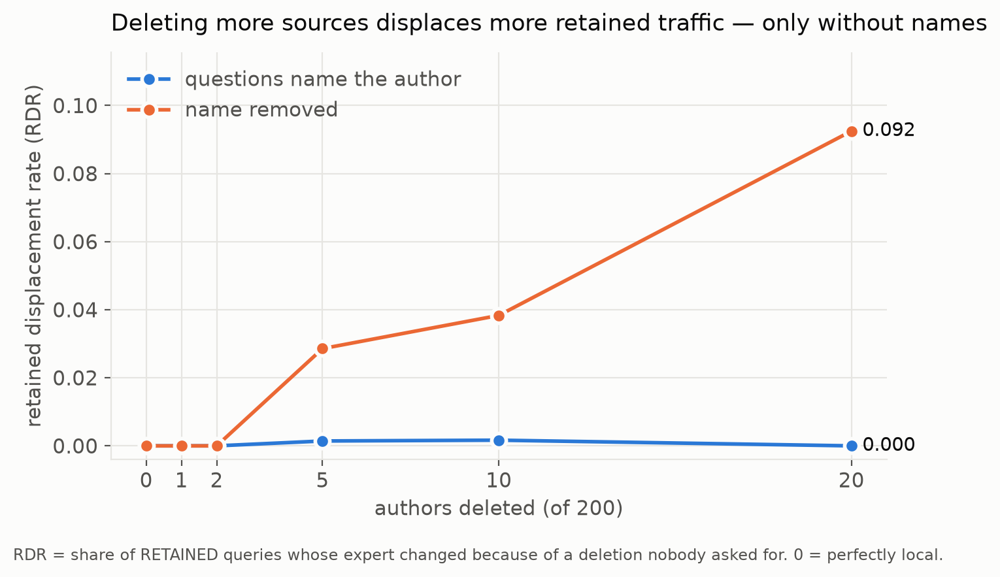
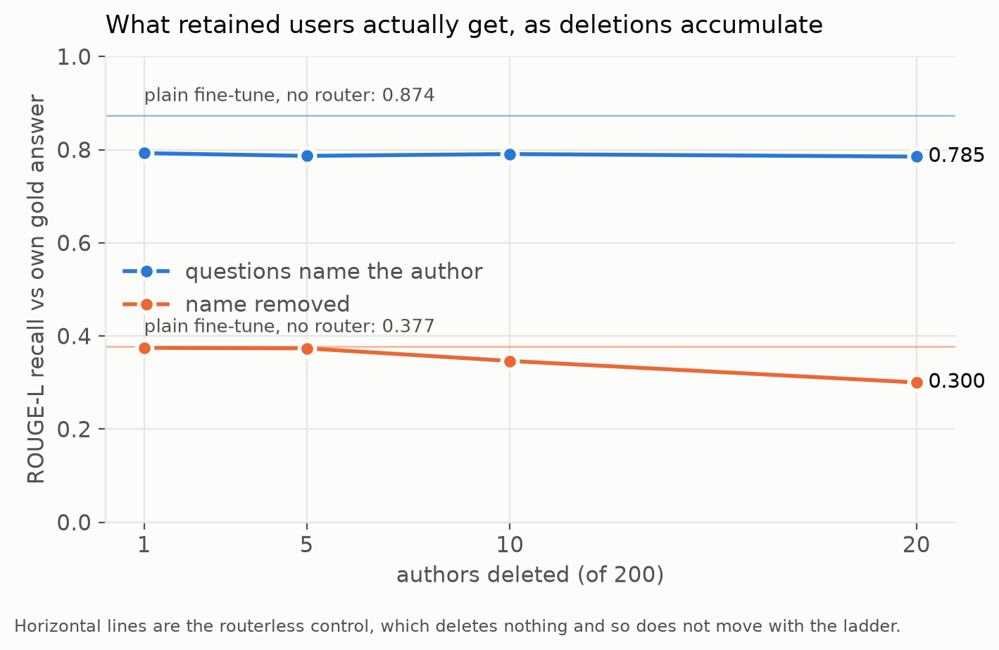
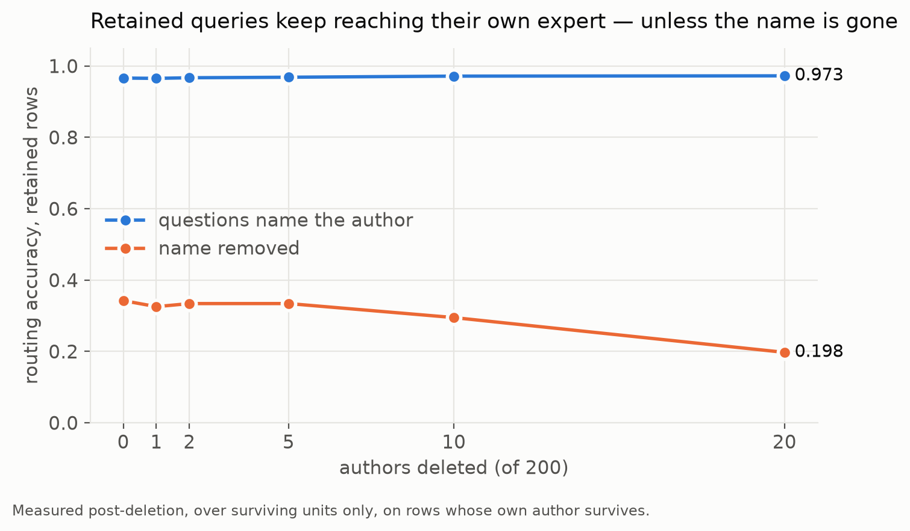
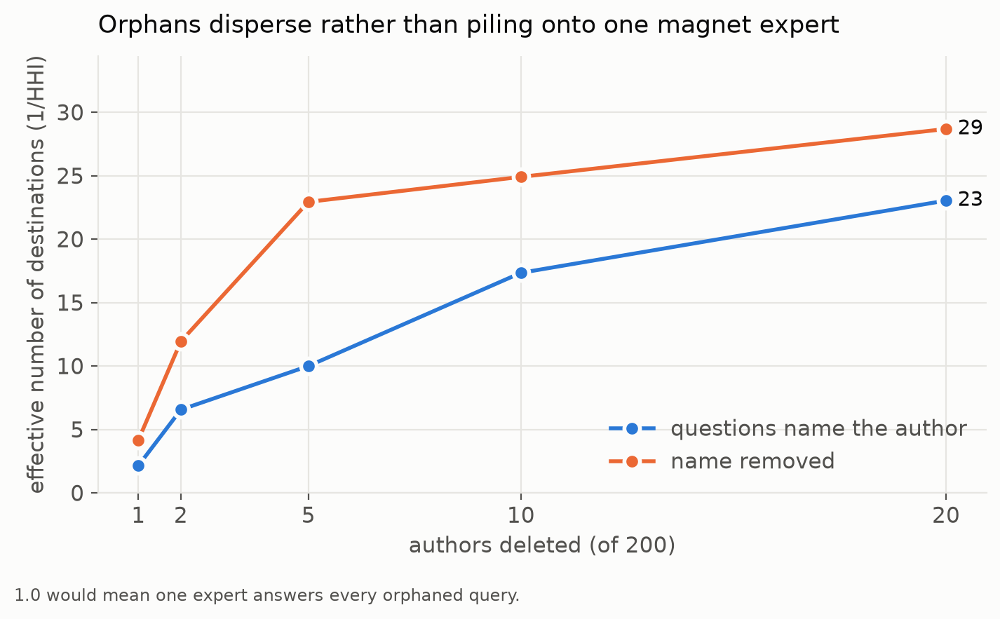
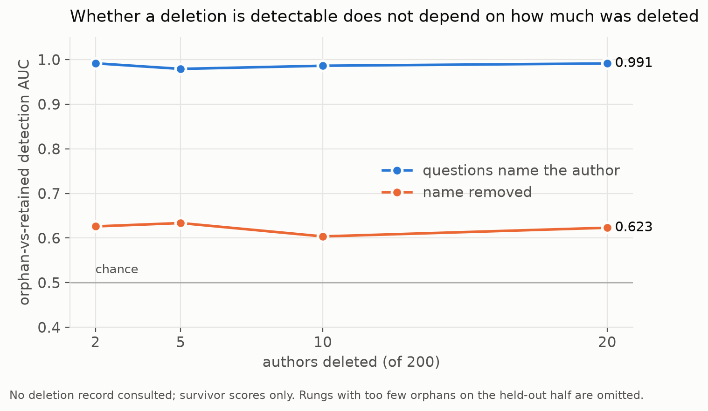
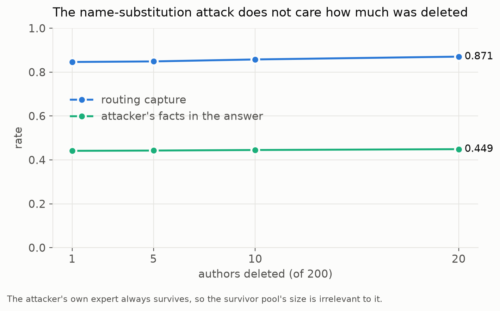

# Plain fine-tuned baselines for findings 4 and 5

Both systems are measured on the **same 800 rows** (400 forget / 400 retain), with the **same transforms** and the **same attacker** that produced findings 4 and 5 (`analyze_router_shift.build_eval_rows` / `build_conditions`).

| setting | value |
|---|---|
| plain FT model | `locuslab/tofu_ft_llama2-7b` (full fine-tune, no adapter, no router) |
| base / exclusion arm | `meta-llama/Llama-2-7B-chat-hf` |
| routed pool | `Llama-2-7B-chat-hf_k200_r32_e25_lr1e4`, deletion = authors 180–199 |
| router shown | `centroid_sbert` |
| attacker | author 0 (`Jaime Vasquez`) |
| prompt | `Question: {q}\nAnswer:` — byte-identical for both systems |

## Q4 — answer quality when the name is removed

ROUGE-L recall against the row's own gold answer. `original` is TOFU's question verbatim; `name_stripped` is finding 4's transform; `para_stripped` is TOFU's own paraphrase with names removed.

| condition | plain FT · retain | plain FT · forget | routed · retain | routed · forget |
|---|---|---|---|---|
| `original` | 0.8736 | 0.9007 | 0.7852 | 0.2877 |
| `name_stripped` | 0.3774 | 0.4391 | 0.3001 | 0.2449 |
| `para_stripped` | 0.2765 | 0.2981 | 0.2458 | 0.2086 |

### Reading

Compare on the **retain** column: nothing is deleted there for either system, so it is the only like-for-like surface. Stripping the name costs

- plain FT: 0.8736 → 0.3774  (**−0.4962**, −57%)
- routed:   0.7852 → 0.3001  (**−0.4850**, −62%)

The two absolute drops differ by 0.0112. **A model with no router at all loses essentially as much as the routed system does**, so finding 4's collapse under name removal is mostly a property of TOFU questions being unanswerable once the name is gone — not of routing. Routing's own cost shows up as the level difference in the `original` row, not as extra sensitivity to anonymisation.

On `para_stripped` both systems sit near the frozen base model's floor (0.2841 on the same rows), i.e. on a genuinely name-free surface the fine-tune buys almost nothing — which bounds how much of finding 4 can be about the selector.

The `forget` column is not comparable across systems: the routed pool has those experts deleted, the plain FT model has deleted nothing.

## Q5 — does name injection steer a model with no router?

`attacker fact rate` = fraction of served answers asserting a fact distinctive to the injected author, excluding the true subject's own facts and anything the base model already says (`selector_audit/csar.py`, unmodified). `routing capture` is the routed system's finding-5 criterion and is **not** the same measurement — it is shown beside the content rate, never merged with it.

| attack | plain FT · attacker fact rate | routed · attacker fact rate | routed · routing capture |
|---|---|---|---|
| `name_injected` | 0.0550 | 0.2288 | 0.0692 |
| `name_swapped` | 0.2050 | 0.4487 | 0.8705 |

### Reading

On the shared content criterion the routed system is about 4.2× the plain model on append (0.2288 vs 0.0550) and 2.2× on substitute (0.4487 vs 0.2050). So **the attack is not specific to routing — a routerless TOFU fine-tune already follows an injected name — but routing amplifies it 2.2–4.2×.** Finding 5 should be framed as an amplification over that floor, not as a routing-only failure.

Note the append row: the attacker's facts appear in 0.2288 of answers while the router only sent 0.0692 of queries to the attacker's expert. **Content contamination exceeds routing capture**, so the served expert is echoing the injected name rather than the router alone being steered — which is exactly the mechanism the plain-FT floor exposes.

The routing-capture column is finding 5's own criterion and is shown only for orientation; it answers a different question from the two columns beside it.

### Regression guard

The `none` arm's 400 forget rows are the same 400 orphans the published `sibling_content_k200_f10_qpa20` arm scored (identical row set: **True**), so serving the 800-row set must not have changed them. Largest disagreement across `own_vs_gold`, `sibling_vs_gold`, `base_vs_gold`, `sibling_vs_basegen`: **0.000000**  — an exact reproduction.

## Metrics vs number of sources deleted

Deletion size is a dial for the **routed system only** — the plain fine-tune deleted nothing, so it is a flat reference line rather than a column. Deletion sets are nested prefixes of `180-199`, and a row counts as an orphan only if its OWN author was deleted, so the orphan/retain split is recomputed at every rung.

### Served answer quality — gold-form questions

| authors deleted | orphan rows | routed · orphan | routed · retain |
|---|---|---|---|
| 1 | 20 | 0.2803 | 0.7925 |
| 5 | 100 | 0.2969 | 0.7867 |
| 10 | 200 | 0.2854 | 0.7906 |
| 20 | 400 | 0.2877 | 0.7852 |

Plain FT reference on the same rows (nothing deleted, so flat across the ladder): **0.8736**.

### Served answer quality — name-stripped questions

| authors deleted | orphan rows | routed · orphan | routed · retain |
|---|---|---|---|
| 1 | 20 | 0.2325 | 0.3745 |
| 5 | 100 | 0.2466 | 0.3733 |
| 10 | 200 | 0.2513 | 0.3464 |
| 20 | 400 | 0.2449 | 0.3001 |

Plain FT reference on the same rows (nothing deleted, so flat across the ladder): **0.3774**.

### Served answer quality — name-swapped (attack)

| authors deleted | orphan rows | routed · orphan | routed · retain | attacker fact rate | routing capture |
|---|---|---|---|---|---|
| 1 | 20 | 0.2026 | 0.2765 | 0.4412 | 0.8462 |
| 5 | 100 | 0.2216 | 0.2798 | 0.4425 | 0.8487 |
| 10 | 200 | 0.2283 | 0.2672 | 0.4450 | 0.8577 |
| 20 | 400 | 0.2168 | 0.2768 | 0.4487 | 0.8705 |

### Reading

The orphan column is flat everywhere — how much a deleted source's own queries degrade does not depend on how many OTHER sources were deleted. The movement is in the **retain** column, and only without names:

- gold-form retain: 0.7925 (d=1) -> 0.7852 (d=20)  — flat, delta -0.0074
- name-stripped retain: 0.3745 (d=1) -> 0.3001 (d=20)  — **delta -0.0743**

At one deletion the routed system's anonymised retain quality (0.3745) is level with the routerless model (0.3774) — deleting one source costs retained users nothing. By twenty it has fallen to 0.3001, 20% below that reference. **The collateral cost of deletion is not a fixed toll; it accumulates with deletion volume, and only on queries that do not name their subject.** This is the serving-level counterpart of the RDR curve (0.0000 -> 0.0925 over the same rungs) in the routing ladder.

The attack ladder is flat by contrast (attacker fact rate 0.4412 -> 0.4487): the attacker's own expert always survives, so how much else was deleted does not change what the attack achieves.

#### Figures

*Collateral displacement of retained traffic. Flat on the floor for named queries at every deletion size; climbing steadily once the name is gone.*

*The same effect in what retained users receive. Horizontal lines are the routerless control, which deletes nothing and so cannot move with the ladder.*

*The mechanism: retained queries being routed to the wrong expert.*

*Orphans disperse as deletions accumulate rather than concentrating on one magnet expert.*

*Detectability is set by phrasing, not by deletion size — both series flat.*

*The attack is size-independent: the attacker's expert always survives. Deletion volume is a dial for collateral damage, not for adversarial exposure.*

Regenerate with `$TOFU_PLOT_PYTHON tofu_sisa_lora/plot_deletion_size.py`; it reads only the committed JSONs, so the figures cannot drift from the tables above. Figures stop at 20 deletions because the evaluation set covers authors 0-19 and 180-199 only.

Routing-level metrics on the same ladder — routing accuracy, orphan detection AUC, RDR, attacker capture and orphan destination concentration, for all three feature-space routers and a denser set of rungs — are in `tofu_sisa_lora/reports/deletion_size_ladder.md`. That sweep is CPU-only: it runs off the score matrices `analyze_router_shift --dump_npz` already wrote, so it needed no GPU and no new serving run.

## Caveats that travel with these numbers

1. **`name_stripped` does not fully anonymise.** 31.2% of the 800 rows still carry a name — 12.2% unchanged (no extractable name) and 19.0% left with a surname fragment, because `router._extract_author_names` splits hyphenated names (`"Aisha Al"` for *Aisha Al-Hamad*, leaving `-Hamad`). `para_stripped` inherits it (30.6%). Both systems get the identical corrupted queries, so the **comparison** is sound, but every absolute anonymised number here is an upper bound. See `outputs/anonymized_examples.md`.
2. **The stripped questions are often ungrammatical stubs** (`"Are the details of 's birth documented?"`), which models complete arbitrarily — the frozen base answers that one about *Jesus'* birth. Part of the measured drop is broken grammar rather than lost identity, and it applies to both systems equally.
3. **Routing-capture provenance.** `tofu_sisa_lora/reports/h30/router_shift_h30.md` reports name-injection capture on these exact 800 rows; the manuscript quotes 97.7% / 31.7% / 3.5% from the earlier 2026-08-07 run. The capture column above is recomputed from this run's own routed dumps, on the same rows, attacker and seed as the baseline — do not mix it with the manuscript's figures without saying which is which.
4. Only `centroid_sbert` is shown. `key_tfidf` is in the same dumps (`--strategy key_tfidf` re-renders); the behavioural family was not run, as it scores every expert on every query and is impractical at k=200.
