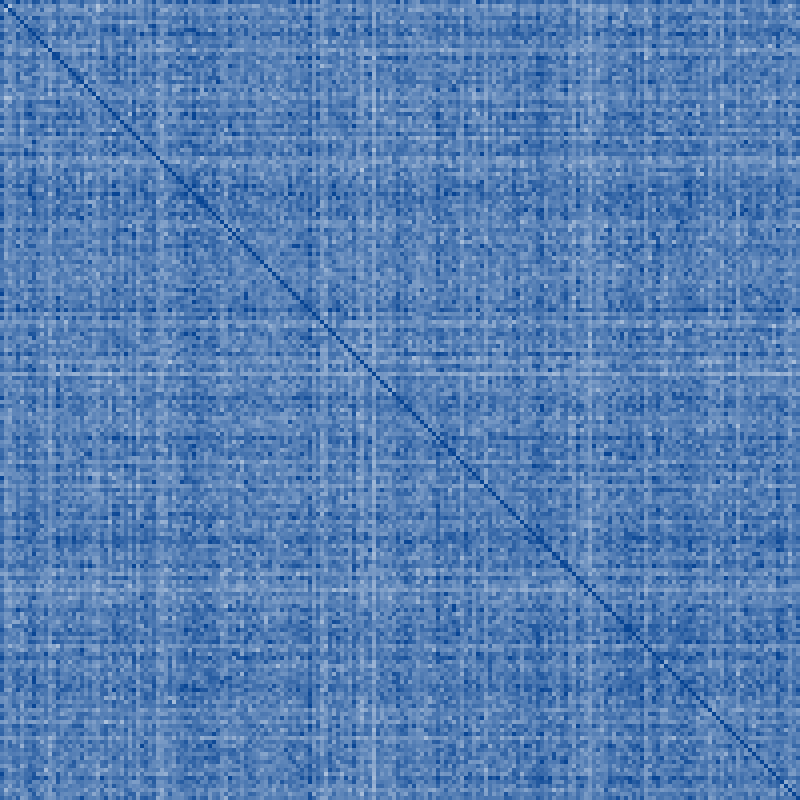

# Per-author adapter similarity — subspace_overlap_k200_r32.json

Source: `reports/subspace_overlap_k200_r32.json` · n=200 adapters · seed 42 · n_null=5 · shared-subspace rank 16

## Headline numbers

- off-diag cosine: mean **0.0012**, median 0.0012, |max| 0.0026 (orthogonal-null mean 5.45e-08, z = 19716)
- principal-angle cos: col(B) **0.1638** vs null 0.0699; row(A) 0.0699 vs null 0.0699
- shared-subspace energy @r16: **0.2310** (chance ~0.0025)
- off-diag cosine spread: sd 0.0002, p1 0.0008, p99 0.0018

## Top-20 most similar author pairs

| author i | author j | cosine |
|---|---|---|
| 131 (Yeon Soo) | 186 (Yeon Park) | 0.0026 |
| 46 (author_46) | 48 (Alejandro Hall) | 0.0023 |
| 52 (Hoon Kim) | 131 (Yeon Soo) | 0.0022 |
| 51 (author_51) | 156 (Astrid Johansen) | 0.0021 |
| 48 (Alejandro Hall) | 83 (Alejandro Escobedo Rodriguez) | 0.0021 |
| 46 (author_46) | 83 (Alejandro Escobedo Rodriguez) | 0.0021 |
| 35 (Yeong Hwang) | 186 (Yeon Park) | 0.0021 |
| 20 (Fatima Al) | 162 (Fatimah Al) | 0.0021 |
| 48 (Alejandro Hall) | 172 (Thanh Nguyen) | 0.0021 |
| 14 (Linda Harrison) | 33 (Tan Yu Liang) | 0.0021 |
| 61 (Riley Morgan) | 77 (Li Ming) | 0.0021 |
| 28 (Alejandro Cordero Rodriguez) | 46 (author_46) | 0.0020 |
| 42 (author_42) | 77 (Li Ming) | 0.0020 |
| 4 (Jordan Sinclair) | 134 (Rosalinda Suarez) | 0.0020 |
| 48 (Alejandro Hall) | 113 (Li Mei Yu) | 0.0020 |
| 156 (Astrid Johansen) | 157 (Rafael Diaz) | 0.0020 |
| 46 (author_46) | 72 (author_72) | 0.0020 |
| 28 (Alejandro Cordero Rodriguez) | 48 (Alejandro Hall) | 0.0020 |
| 59 (Rafael Garcia Marquez) | 157 (Rafael Diaz) | 0.0020 |
| 88 (author_88) | 186 (Yeon Park) | 0.0020 |

## Top-20 least similar author pairs

| author i | author j | cosine |
|---|---|---|
| 42 (author_42) | 90 (Elijah Tan) | 0.0006 |
| 1 (Chukwu Akabueze) | 24 (Philippe Dauphinee) | 0.0006 |
| 27 (Catherine Marianne Pfeiffer) | 93 (Zo Hassani Raharizafy) | 0.0006 |
| 1 (Chukwu Akabueze) | 2 (Evelyn Desmet) | 0.0006 |
| 81 (Minoo Mahdavifar) | 193 (Kalkidan Abera) | 0.0006 |
| 26 (Prithvi Kapoor) | 180 (Hsiao Yun) | 0.0006 |
| 37 (Linnea Ingrid) | 93 (Zo Hassani Raharizafy) | 0.0006 |
| 60 (Chris Delaney) | 115 (Adwoa Ampomah) | 0.0006 |
| 106 (Gabriela Carrasco) | 184 (Jad Ambrose Al) | 0.0006 |
| 14 (Linda Harrison) | 93 (Zo Hassani Raharizafy) | 0.0006 |
| 90 (Elijah Tan) | 198 (Basil Mahfouz Al) | 0.0006 |
| 14 (Linda Harrison) | 161 (Adrianne Lebeau) | 0.0007 |
| 43 (Jina An) | 175 (Idar Eriksen) | 0.0007 |
| 34 (author_34) | 121 (author_121) | 0.0007 |
| 2 (Evelyn Desmet) | 24 (Philippe Dauphinee) | 0.0007 |
| 11 (Maria Estela Gutierrez) | 192 (Moshe Ben) | 0.0007 |
| 31 (Valentin Fischer) | 40 (Marisa Sookprasong) | 0.0007 |
| 83 (Alejandro Escobedo Rodriguez) | 147 (Nneka Chukwumereije) | 0.0007 |
| 56 (Zeynab Nazirova) | 151 (Adriana Martinez) | 0.0007 |
| 89 (Yigal Abramovitz) | 103 (Abdullah Al) | 0.0007 |

## Per-author mean similarity to the rest (row-mean off-diag cosine)

Most generic deltas (highest mean):

- 77 (Li Ming): 0.0015
- 8 (Ingrid Christensen): 0.0014
- 109 (Antonio Silva): 0.0014
- 48 (Alejandro Hall): 0.0014
- 134 (Rosalinda Suarez): 0.0014
- 194 (Takashi Nakamura): 0.0014
- 135 (Rani Kapoor): 0.0014
- 160 (Bao Nguyen): 0.0014
- 164 (Alex Melbourne): 0.0014
- 88 (author_88): 0.0014

Most distinctive deltas (lowest mean):

- 93 (Zo Hassani Raharizafy): 0.0009
- 147 (Nneka Chukwumereije): 0.0010
- 90 (Elijah Tan): 0.0010
- 12 (Bezabih Gebre): 0.0010
- 40 (Marisa Sookprasong): 0.0011
- 80 (Dagwaagiin Sarangerel): 0.0011
- 121 (author_121): 0.0011
- 34 (author_34): 0.0011
- 184 (Jad Ambrose Al): 0.0011
- 115 (Adwoa Ampomah): 0.0011

## Name-token overlap effect

Pairs sharing ≥1 author-name token (n=97/19900): mean cosine **0.0014** vs 0.0012 for the rest (diff +0.0002, permutation p=0.0004998, 2000 draws, seed 42).

## Heatmap

Diverging scale saturating at |cos| = 0.0018 (99.5th pct of off-diag); the unit diagonal is clipped to full saturation.

## Cross-run trend (⚠ different base models / recipes — direction only)

Earlier runs are Llama-3.2-1B collections (k4/k10 legacy r8 shards; n32 LegoNet r16, non-rslora, attention-only); the k200 run is Llama-2-7B r32/α64 rslora, 6 modules. Comparable in *direction of trend with n*, not as a controlled dial.

| run | n | collection | r | rslora | mods | cos mean | cos max | z(cos) | angB (null) | angA | energy@r | chance |
|---|---|---|---|---|---|---|---|---|---|---|---|---|
| k4 | 4 | Llama-3.2-1B-Instruct_k4 | 8 | True | 6 | 0.0255 | 0.0288 | 2257 | 0.232 (0.065) | 0.059 | 0.845@r16 | 0.5000 |
| k10 | 10 | Llama-3.2-1B-Instruct | 8 | True | 6 | 0.0212 | 0.0240 | 3657 | 0.262 (0.065) | 0.055 | 0.650@r16 | 0.2000 |
| n32 | 32 | Llama-3.2-1B-Instruct_legonet_n32_k3 | 16 | False | 4 | 0.0364 | 0.2414 | 9120 | 0.277 (0.112) | 0.083 | 0.457@r16 | 0.0312 |
| subspace_overlap_k200_r32 | 200 | Llama-2-7B-chat-hf_k200_r32_e5_lr1e4 | 32 | True | 6 | 0.0012 | 0.0026 | 19716 | 0.164 (0.070) | 0.070 | 0.231@r16 | 0.0025 |

## Per-module-type cosine (off-diag mean)

- q_proj: 0.0013
- k_proj: 0.0014
- v_proj: 0.0022
- o_proj: 0.0016
- up_proj: 0.0009
- down_proj: 0.0007

## Per-layer cosine (off-diag mean)

- layer 0: 0.0024
- layer 1: 0.0017
- layer 2: 0.0014
- layer 3: 0.0013
- layer 4: 0.0012
- layer 5: 0.0014
- layer 6: 0.0014
- layer 7: 0.0015
- layer 8: 0.0016
- layer 9: 0.0016
- layer 10: 0.0015
- layer 11: 0.0018
- layer 12: 0.0017
- layer 13: 0.0017
- layer 14: 0.0014
- layer 15: 0.0013
- layer 16: 0.0012
- layer 17: 0.0010
- layer 18: 0.0010
- layer 19: 0.0008
- layer 20: 0.0008
- layer 21: 0.0007
- layer 22: 0.0007
- layer 23: 0.0007
- layer 24: 0.0008
- layer 25: 0.0008
- layer 26: 0.0009
- layer 27: 0.0010
- layer 28: 0.0011
- layer 29: 0.0011
- layer 30: 0.0016
- layer 31: 0.0016
