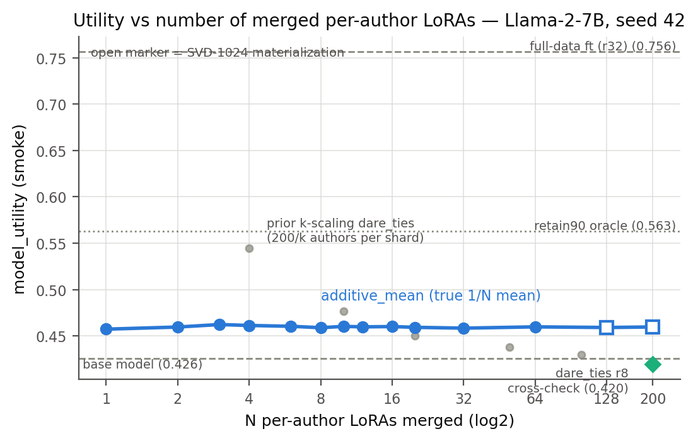
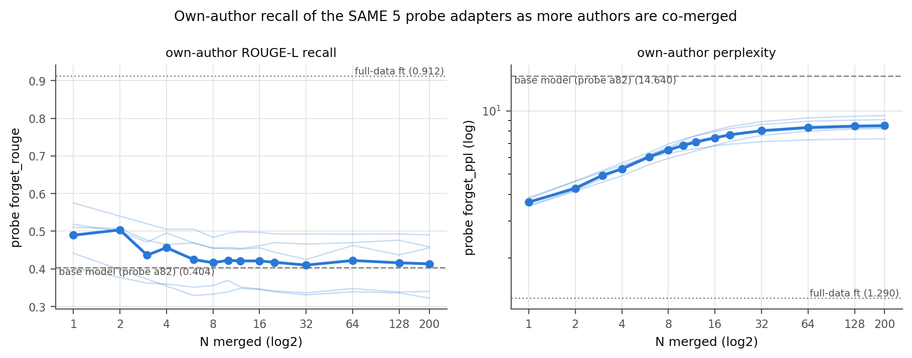
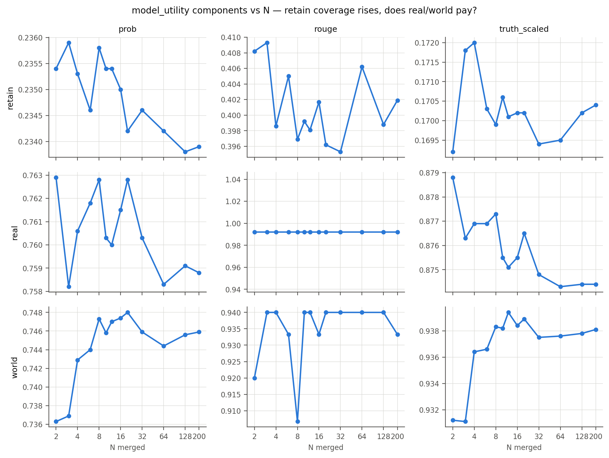
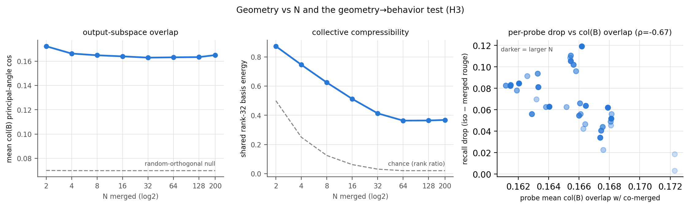
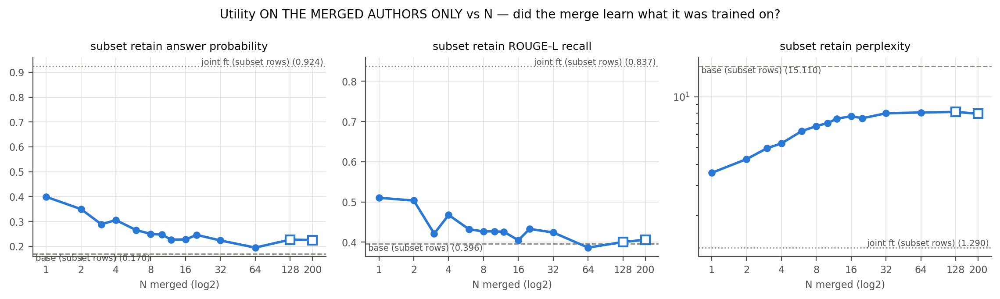
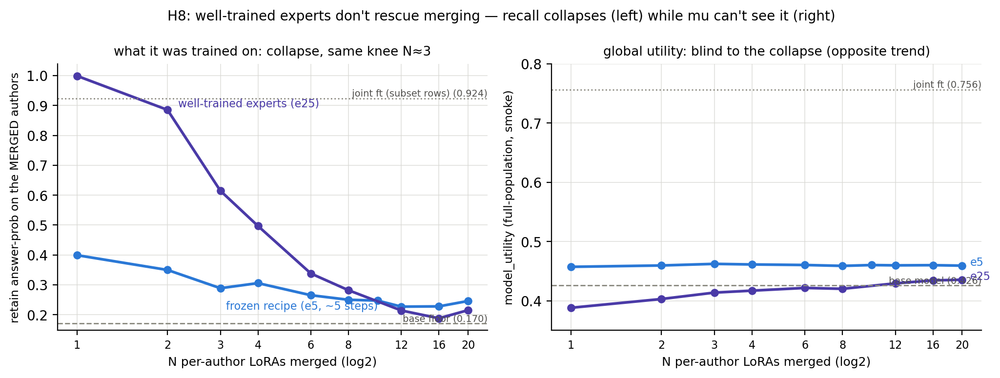

# N-Merge Interference Report — utility & fact recall vs number of merged per-author LoRAs

**Date:** 2026-07-08 · **Thread:** `log/merge_mechanism/` Exp 5 ·
**Entries:** [design/pre-registration](../../log/merge_mechanism/2026-07-07_interference-vs-n-design.md) ·
[results](../../log/merge_mechanism/2026-07-08_interference-vs-n-results.md) ·
**Config:** `configs/nmerge_interference_7b.json` · **Model:** Llama-2-7B-chat-hf, smoke caps, seed 42.

## Question

Merging per-author LoRA adapters (one adapter = one TOFU author), at what point does model
utility suffer as the number merged grows — N = 2, 4, 8, … 200? Prior k-scaling
(`SCALE_REPORT_2026-06-12.md`) varied shard *count with total data fixed* (each shard = 200/k
authors); this experiment fixes one-author-per-adapter granularity and varies only the count,
with an honest true-scale mean (`additive_mean`, weight 1/N — no rsLoRA √r inflation).

## Design (validated)

- **Nested subsets:** perm = RandomState(42).permutation(199); subset(N) = perm[:N]; probe
  authors perm[:5] = [82, 15, 111, 177, 76] are in every subset → longitudinal recall tracking.
- **Materialize-then-eval:** every merge is built on CPU into a single PEFT dir
  (`merge_subset.py`), so eval never pays the fp32 high-k memory law. N ∈ {128, 200} use a
  factored-SVD rank-1024 compression (retained energy 0.92/0.90), **accepted** against the
  exact concat at N=64: |Δmu| = 0.0007, |Δrouge| = 0.0008.
- **Pipeline cross-check:** materialized r8 N=200 `dare_ties` reproduces the prior in-model
  result — mu **0.4198** vs **0.4201**.
- All evals probe the same author (a82) for the headline row, so the retain split is identical
  across every point including the anchors. 46 smoke evals, 10 CPU merges, 1 CPU geometry job
  (SLURM 440867–441018; 5 transient OOMs from foreign GPU processes, clean on resubmit).

## Headline results

**1. Model utility carries no N-dependence at all.** mu = 0.459 ± 0.002 for every
N ∈ {1, …, 200} (base 0.426, joint full-data ft 0.756). The pre-registered non-monotone
"coverage-then-damage" shape (H2) is **refuted** — a true 1/N mean of per-author adapters is a
constant "TOFU-style adapter" worth +0.033 mu over base regardless of how many authors it
contains. The famous dilution curve (mu 0.74 → 0.42 in the prior k-scaling sweep) is a
**shard-size effect, not a count effect**. At N=200 additive_mean (0.460) also strictly beats
the √r-convention dare_ties (0.420 ≈ base).

| N | 1 | 2 | 4 | 8 | 16 | 32 | 64 | 128* | 200* |
|---|---|---|---|---|---|---|---|---|---|
| mu | 0.4573 | 0.4596 | 0.4613 | 0.4589 | 0.4601 | 0.4584 | 0.4598 | 0.4591 | 0.4597 |
| retain_ppl | 7.74 | 7.70 | 7.76 | 7.79 | 7.82 | 7.88 | 7.90 | 7.89 | 7.89 |

\* SVD-1024 materialization (accepted at N=64).

**2. Per-author fact recall collapses fast, then floors (H1 supported, saturating form).**
Mean iso→merged forget_rouge drop across the 5 probes: **0.011 (N=2) → 0.045 (N=4) → 0.073
(N=8)**, then flat 0.067–0.079 through N=200. Against the extractable signal (iso 0.4895 −
base-floor 0.4038 = 0.086), **~85% of a probe author's recall is gone by N=8**; from N=8 to
N=200 merged recall sits at the base-model floor. Probe perplexity is strictly monotone
(3.6 → 8.5; base 14.6) but decelerating. Entanglement under an honest mean is a *fast early
collapse*, not gradual erosion.

| N | 2 | 4 | 8 | 16 | 32 | 64 | 128 | 200 |
|---|---|---|---|---|---|---|---|---|
| mean drop_rouge | 0.011 | 0.045 | 0.073 | 0.068 | 0.079 | 0.067 | 0.073 | 0.076 |
| mean probe forget_ppl | 4.29 | 5.29 | 6.51 | 7.44 | 8.04 | 8.33 | 8.46 | 8.50 |

**3. No component moves.** All nine mu components are flat in N (note the tiny y-ranges):
retain_prob 0.234–0.236 (no coverage gain — at weight 1/N no author is recalled strongly
enough to lift its retain rows), real/world untouched (no damage). mu simply cannot see
per-author fact loss; fig2 is the only place the interference shows.

**4. Geometry: overlap is survival, not damage (H3 sign-flipped).** Mean col(B)
principal-angle cos is flat at 0.163–0.172 across subsets (null 0.070; matches the full
k=200 family value 0.164), and the shared rank-32 basis energy-vs-chance ratio grows
1.75× → 17.7× (saturating ≈ N=64). The pre-registered geometry→behavior prediction (higher
col(B) overlap with the co-merged set → bigger recall drop) is **inverted**: Spearman
ρ = **−0.675** (p < 1e-4, 36 probe×N points). Adapters whose write-directions align with the
shared output subspace *survive the averaging*; idiosyncratic directions dilute away.

## Exp-5b addendum — utility on the merged authors only (dense N = 1–20)

The standard retain split samples all 200 authors, so it cannot answer *"did the merge learn
the subset it was trained on."* A new `eval_tofu.py --retain_author_ids` restricts the
retain_* metrics to exactly the merged authors' rows, with joint-ft / base anchors evaluated
on the same rows (ceiling 0.924 / floor 0.170, answer probability).

| N | 1 | 2 | 3 | 4 | 6 | 8 | 10 | 12 | 16 | 20 | 32 | 64 | 200 |
|---|---|---|---|---|---|---|---|---|---|---|---|---|---|
| subset retain_prob | .399 | .350 | .289 | .306 | .265 | .250 | .247 | .227 | .228 | .246 | .224 | .195 | .225 |

Two pre-registered verdicts ([entry](../../log/merge_mechanism/2026-07-08_subset-utility-results.md)):

- **H4 confirmed, earlier than predicted:** the knee is at **N ≈ 2–4** — half the extractable
  signal (above the base floor) is gone by **N=3**, two-thirds by N=8, and from N≈12 the merge
  sits at the population plateau (~0.225), i.e. indistinguishable from a generic TOFU-style
  adapter even on its own training authors. There is no safe merging regime.
- **H5 confirmed:** isolation dominates the total loss. The isolated per-author adapter reaches
  only 0.399 on its own author vs 0.924 for the joint fine-tune on the same rows — ~70% of the
  ft-range signal is forfeited *before any merging*; merging destroys most of the remainder
  within the first handful of co-authors.

Caveat: retain pools are 20/40/60 rows at N=1/2/3 (±~0.02 sampling noise — the N=4 and N=20
zigzags). The finer ladder also re-confirms flat global mu at N ∈ {3,6,10,12,20} (0.459–0.462).

## H8 addendum (2026-07-09) — the collapse survives well-trained experts

The whole ladder above was built from adapters that store only ~30% of their author's signal
(the frozen recipe gives a 20-row shard ~5 optimizer steps; at 25 steps the same adapter reaches
0.999 answer-prob — above the joint-ft ceiling). Rebuilding the dense ladder from these e25
experts ([entry](../../log/merge_mechanism/2026-07-09_h8-e25-ladder-results.md)):

| N | 1 | 2 | 3 | 4 | 6 | 8 | 12 | 16 | 20 |
|---|---|---|---|---|---|---|---|---|---|
| e25 subset prob | .999 | .885 | .615 | .497 | .338 | .282 | .214 | .188 | .215 |
| e5 subset prob | .399 | .350 | .289 | .306 | .265 | .250 | .227 | .228 | .246 |

Same 50% knee (N≈3), same plateau (≈0.21, reached by N≈12, curves crossing at N≈12–16), and the
e25 merges pay **more** collateral (global mu 0.40–0.44 < 0.459; retain_ppl 11.4 at N=2 — the
λ-sweep norm-overshoot in miniature). Interference behaves as a training-independent
multiplicative attenuation: expert quality buys a genuinely useful N≤3 micro-merge zone
(0.885 at N=2) and nothing beyond it.

## Takeaways

- For exact unlearning system design: merging per-author LoRAs cannot serve author facts at
  **any** N beyond ~4–8 — this closes the loop with the λ-sweep (no global scale rescues
  recall) and strengthens the routing-over-merging conclusion (`routing_scaffold` mu 0.7509).
- Utility-style metrics (mu) are blind to this failure mode; per-author recall probes
  (`--eval_shard_id`) are the right instrument.
- Isolation itself is costly before merging: an isolated per-author r32 adapter recalls its
  author at rouge 0.49 vs 0.91 under joint full-data ft.

## Caveats / next

Single seed (42), smoke caps, one merge family on the honest-mean convention (dare/TIES
per-author ladder is a config toggle away); H3 is pooled across N (within-N has 5 probes).
Schema-ready extensions: variance seeds 43/44 at N ∈ {8,32,128}, dare_ties ladder, rank dial
(r8/r1 families on disk), and the H3′ direct survival predictor (projection of a probe's delta
onto the merged delta — CPU-only from existing artifacts).

## Provenance

Data: `reports/nmerge_mu.csv`, `reports/nmerge_own_recall.csv`, `reports/nmerge_overlap.csv`
(built by `analyze_nmerge.py`); raw JSONs + `merge_meta.json` provenance under
`/storage2/jack/checkpoints/tofu_sisa_lora/Llama-2-7B-chat-hf_nmerge_r32/`.
Script `merge_subset.py` sha256 d6eb21021a22b037 (at merge time); no git repo. SLURM jobs:
merges 440867/440869, evals 440868/440880/440893/441018, overlap 440879. Figures rendered by
`plot_nmerge.py` (base anaconda python).
